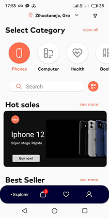
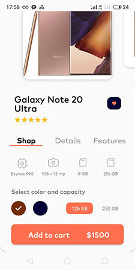
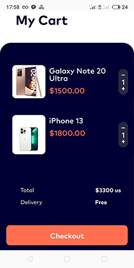

# О приложении
Тестовое задание "Магазин техники"

Приложение позволяет загружать из сети данные о продаваемой технике и спец. предложениях.

## Скриншоты
   

## Используемый стек
- Clean architecture
- MVVM
- Kotlin Coroutines
- Retrofit
- Glide
- RxJava

### Возможности приложения
- Реализованы 3 экрана: Главный, Детали продукта и Корзина
- Позволяет выбрать город
- Позволяет выбирать категорию товаров
- Выводит количество добавленных товаров в корзину в нижнем меню навигации (с помощью Badges)
- "Горячие предложения" и изображения продукта выводятся в ViewPager2, данные подгружаются из сети
- "Лучшие предложения" выводятся в RecyclerView, данные подгружаются из сети
- Пользователь может перейти на экран Деталей выбранного продукта
- Пользователь может переключаться между экранами меню

#### Формулировка задания
https://docs.google.com/document/d/1VedkRcsN6yukGO2uWES4RuIM8KMtESZ8p7zD7nGySMs/edit

Дизайн приложения: https://www.figma.com/file/KqZcU5m3GMxAHwgFkvCONz/ECOMMERCE?node-id=2%3A845

#### Разработчик
Альберт Сафин
